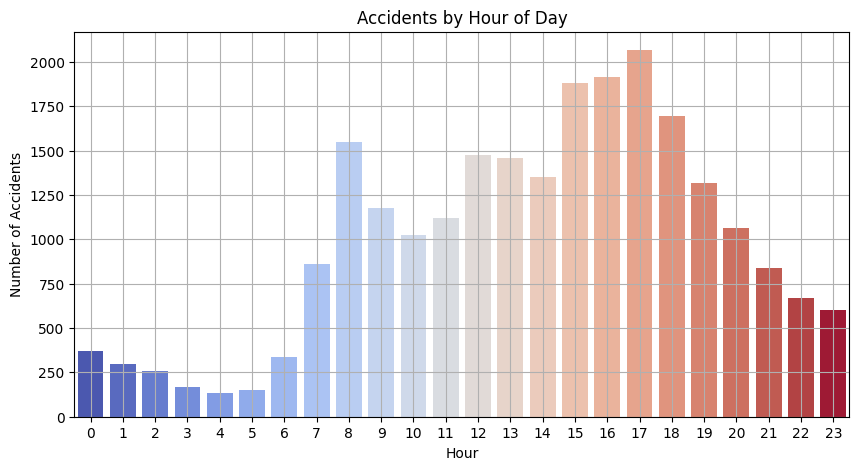
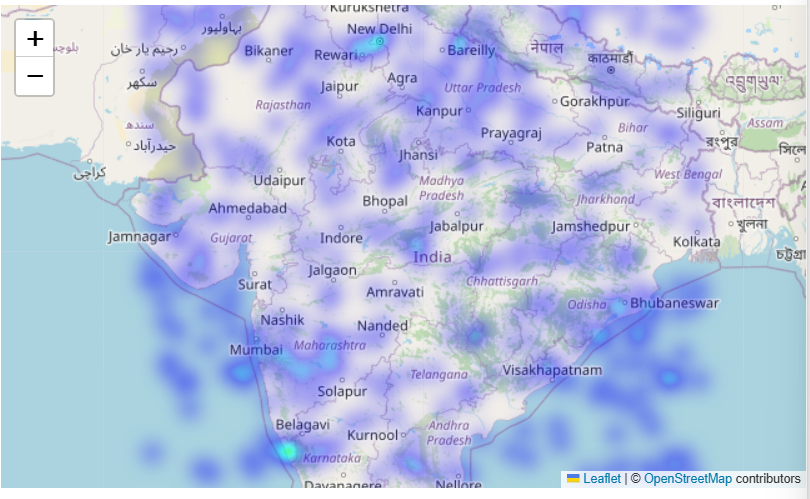

# Traffic Accident Analysis

This project focuses on analyzing traffic accident data using Python in Google Colab. The objective is to uncover patterns in accident severity, identify peak accident times, and visualize accident hotspots to support safer road planning and decision-making.

##  Objective

- Analyze traffic accident trends and patterns
- Identify high-risk hours of the day
- Map accident hotspots for better urban and traffic planning
- Visualize data to enable better insights and decisions

## Tools & Technologies

- **Google Colab** – Online Python environment
- **Python** – Main programming language
- **Pandas** – Data preprocessing and cleaning
- **Matplotlib & Seaborn** – Data visualizations
- **Folium** – Geospatial heatmaps
- **Plotly** – (Optional for interactive charts)

## Repository Contents
                         
 *Traffic_Accident_Analysis.ipynb
 *Accidents_by_Hour.png      
 *Heatmap.png                
 *accident_hotspots_map.html 
 *License                    

## Key Analysis Performed

 **Time-Based Analysis**  
  Visualized how accident frequency changes throughout the day.

 **Accident Hotspot Mapping**  
  Generated heatmaps and interactive maps to highlight areas with dense accident occurrences.

##  Visual Highlights

###  Accidents by Hour  

###  Accident Hotspot Heatmap  

For an interactive experience, open:  
 **[accident_hotspots_map.html](accident_hotspots_map.html)**

##  License

This project is licensed under the terms described in the [License](License) file.

##  Acknowledgements

- Data inspired by public traffic safety datasets.
- Visualization techniques adapted from standard data analysis practices.

---

## Contact

For suggestions or feedback, feel free to raise an issue or connect via GitHub.

